# O Desafio da DIO - Cibersegurança Riachuelo - Laborátorio Brute Force

# O Laborátorio

Visto que o desafio é flexível, resolvi adaptá-lo à realidade de uma pequena empresa, um cenário comum encontrado em vários lugares.

Para isso, utilizei o PnetLab configurado com um pequeno laboratório de testes, com máquinas Windows, servidor Windows Server, roteador MikroTik e um switch L2 Cisco, ao qual todas as estações estão conectadas.

O objetivo desse cenário é testar ataques em máquinas Windows e Windows Server, mostrando como sistemas operacionais mal configurados são suscetíveis a ataques, para depois mostrarmos como podemos prevenir ou mitigar esses ataques.

Para o atacante, foi utilizada uma máquina com Kali Linux e suas ferramentas nativas.

  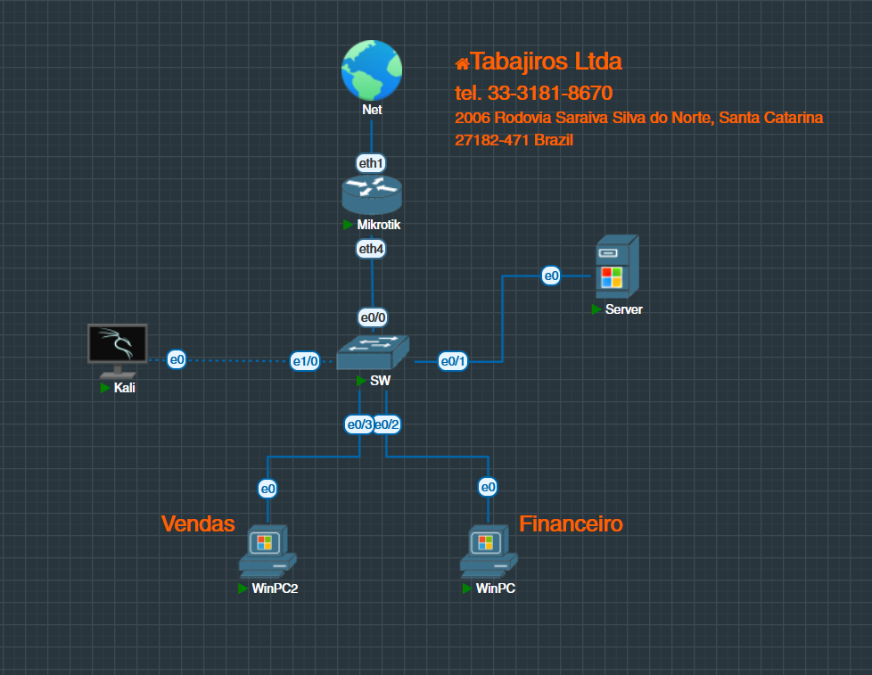

O Laborátorio representa a empresa ficticia **Tabajiros Ltda**(homenagem ao nome de uma empresa nostalgica de um antigo programa de humor), o número de telefone e endereços são ficticios, gerados por geradores de dados gratuitos na internet.

É necessário termos esse tipo de dado ficticio, pois é comum que hackers utilizem *Open Source Inteligence* (OSINT) para capturar dados de empresas na internet e assim montar o ataque.

# Montando o Ataque
Ao conectarmos o dispositivo atacante na rede, primeiramente precisamos saber qual é o endereço de rede para começarmos a nossa varredura, para isso utilizamos o comando `ip -a` no Linux.

  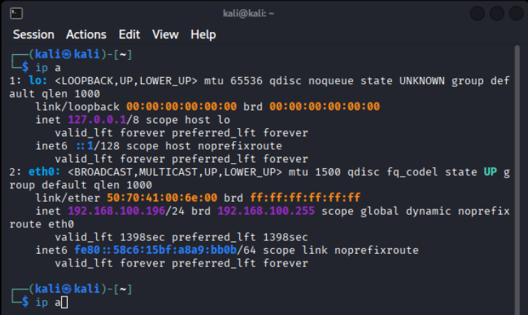

Como podemos ver, o IP do nosso computador é o `192.168.100.196` e a rede é `192.168.100.0/24`, usaremos esse escopo para começar nosso escaneamento.

# Varredura da Rede
Para a varredura da rede usamos o **Nmap**.
O Nmap é um poderoso scanner de rede, que permite vários tipos de varreduras.

No nosso caso utilizamos uma varredura com TCP Syn Scan ao invés de usarmos o PING via ICMP, alguns dispositivos podem ser configurados para não responder ao PING, ou mesmo gerar alertas, por isso a opção do Syn Scan, para tal utilizamos o parâmetro `-sS`.

Também Utilizamos o Parâmetro `-sV`, ele lista quais as versões dos serviços encontrados no rastreamento, muito útil para que possamos futuramente explorar vulnerabilidades em versões desatualizadas desses serviços, com programas como o Metasploit e o msfconsole. 

Passamos para o Nmap explorar todo o dominio de broadcast primeiro, no caso o endereço da rede 192.168.100.0/24, em uma rede que possívelmente tenha VLANs, tentariamos em seguida explorar CIDRs maiores, como um /16 por exemplo.

E por ultimo utilizamos o parâmetro `oN`, ele grava o resultado do scanner em um arquivo, útil para consultarmos depois

  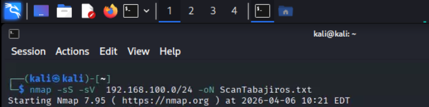

O resultado da varredura nos trouxe alguns IPs interessantes a serem explorados, entre eles o 192.168.100.250. Ele é interessante por haver alguns serviços como o compartilhamento de arquivos (TCP 445) e o terminal services da microsoft (TCP 3389), ambos serviços que podemos explorar.

  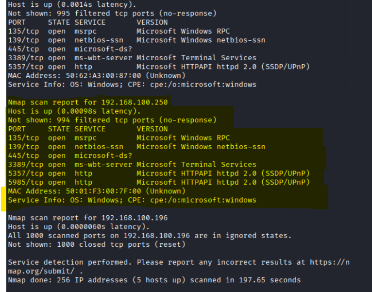

Depois de feito a varredura usaremos o Enum4Linux, ele enumera usuários do SMB e outros servisço, a fim de encontrarmos possíveis falhas ou brechas, como hostnames, workgroups, nomes de usuário do SMB.

  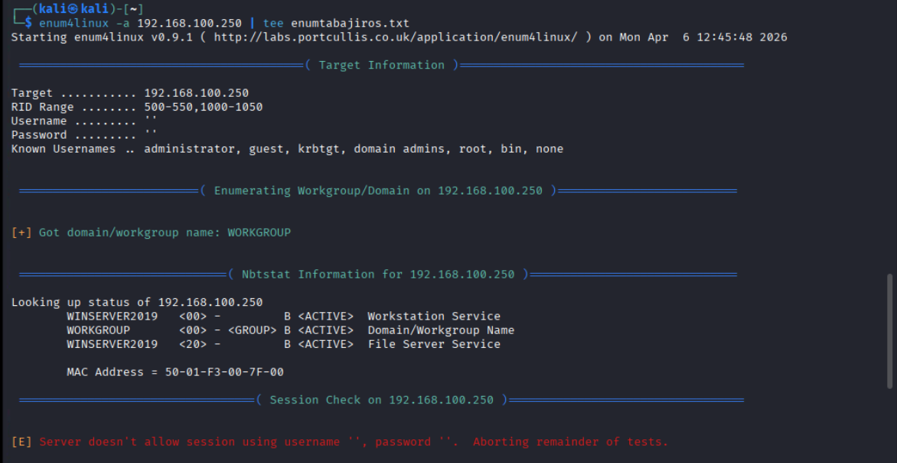

Como vimos a maquina em questão é um servidor, e roda o Windows Server 2019.

# Preparando as Listas

Após determinarmos o alvo, que o no nosso caso é o IP 192.168.100.250, e os serviços de RDP na TCP/3389 e SMB na TCP/445. Vamos criar as Wordlists, que são as listas de logins e senhas que usaremos para o nosso ataque de força bruta, afim de romper as senhas e ter acesso ao dispositivo.

Para criar a ambas as listas usaremos a ferramenta CUPP, para isso acessamos sua pagina no GitHub: https://github.com/mebus/cupp
clonamos seu diretório com um `git clone https://github.com/mebus/cupp`. Damos permissões de execução para o CUPP com o `chmod+x` e depois podemos executa-lo com o comando `cupp -i`

  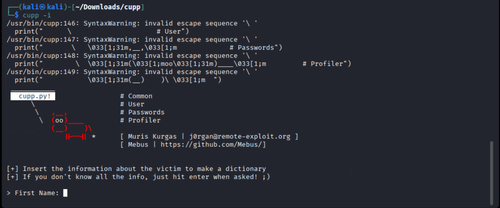

O Cupp perguntará vários dados como nome, sobrenome, endereços, numeros e etc. e com esses dados ele montará uma wordlist que podemos utilizar para nossos ataques. 

  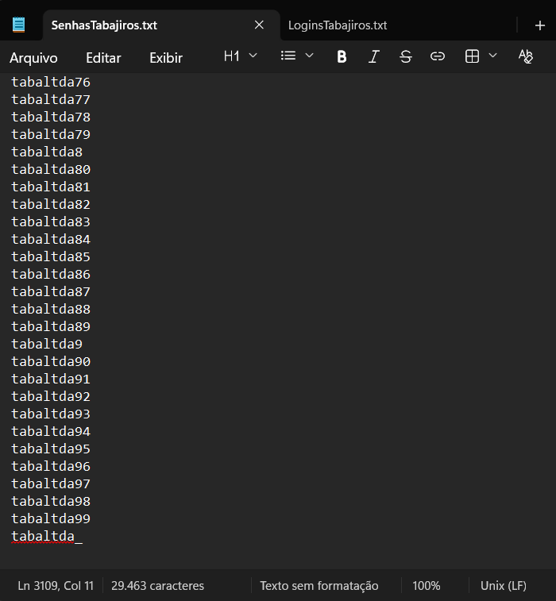

Como podemos ver ele montou uma wordlist de senhas com 3109 combinações baseadas nos dados que fornecemos.

Como a empresa é ficticia, optamos por utilizar o CUPP, porém atacantes reais podem utilizar scripts e programas que extraiam esses dados de inteligência diretamente de sites e perfis públicos da empresa, como o CeWL. 

A nossa worlist de logins foi montada utilizando os logins provaveis mais comuns em ambientes empresariais, como nomes de departamentos, usuários e senha padrão de sistemas operacionais e dispositivos e nomes de pessoas.

# Operando o Ataque de Força Bruta 
Existem várias ferramentas de ataque de força bruta, como o Hydra e o Ncrack, mas nesse laborátorio foi nos designado a utilziar o Medusa.

O Medusa é uma poderosa ferramenta que permite vários tipos de ataque de força bruta entre eles o password sprayng, o qual ele testa uma senha com várias contas diferentes, assim possibilitando maior ocultabilidade ao ataque

Com as listas (wordlists) prontas e o alvo determinado, vamos rodar o Medusa.

  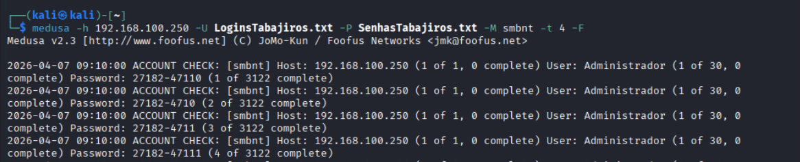

Rodamos o Medusa passando para ele o IP do alvo, as wordlists, o serviço a ser atacado e o parâmetro `-F` para que ele pare o ataque assim que encontrar um sucesso.

  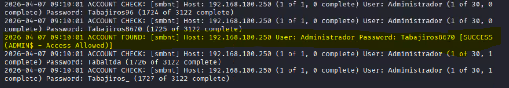

Encontrado com sucesso o usuário **Administrador** e a senha **Tabajiros8670**.

# Acessando o Servidor Alvo
Agora com o usuário e a senha de administrador podemos acessar o servidor alvo e descobrir os segredos dentro dos arquivos da empresa.

  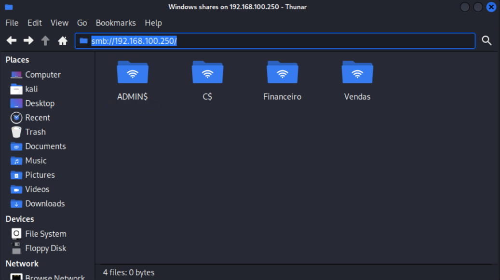

Como podemos ver as pastas Financeiro e Vendas estão acessiveis a nós, como usuário Administrador.

Podemos também testar essa senha para outros protocolos, como o RDP e assim ter acesso completo ao servidor.

  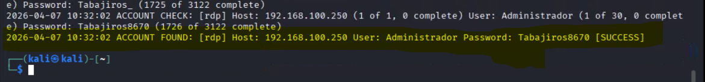

# Corrijindo Vunerabilidades
Como vimos, a empresa tabajiros está repleta de vulnerabilidades a serem exploradas. O gerente, seu Clayson, pediu para enumerarmos quais medidas poderiamos tomar para que a empresa não estivesse exposta dessa forma, vamos elencar algumas medidas e explica-las.

* ### Seperação das redes em VLANs
A seguimentação da rede em VLANS além de melhorar o trafego de pacotes broadcast, permite isolar com segurança cada setor da rede, dificultando varreduras, espalhamento de vírus de redes, e acesso não qualificados a outras maquinas.
* ### Separação da VLAN de Convidados
Separação da rede de convidados da empresa é algo essencial para a segurança, assim pessoas de fora da empresa não tem acesso a rede corporativa interna, preferêncialmente os clientes conectados na VLAN convidado não devem ter acesso as VLANs corporativas, sendo necessário alguma regra de firewall ou ACLs para esse bloqueio.
* ### Senhas Aleatórias
Como vimos na senha do servidor (Tabajiros8670) composta do nome da empresa, com inicial maiuscula e os quatro ultimos digitos do telefone. Apesar de ser uma senha forte, seguindo o padrão do windows server, com o serviço de inteligência podemos sujerir essa combinação, o uso correto de senhas seriam senhas compostas por caracteres aleatórios, se a sua senha pode ser lida, decorada, ou contém alguma informação pessoal, ela não é uma senha segura.

# Conclusão
Vimos aqui que uma vez que o atacante tem acesso a rede, pode-se comprometer de forma grave uma empresa, o teste realizado foi de um ataque de força bruta, porém é cabivel outros tipos de ataque, como o *men-in-the-middle* , que pode capturar informações mais sérias que são enviadas pela rede. 
Também é perceptivel que uma simples segmentação em VLANs e senhas geradas aleatoriamente já dificultariam em muito a vida do atacante.
Porém esse cenário, do qual a empresa fornece uma rede WiFi para clientes, e que está no mesmo seguimento da rede corporativa, é muito comum. Esse laborátorio para além de cumprir os desafio do Bootcamp de segurança Riachuelo pela DIO, serve como uma forma de aprendizado para que possamos construir e configurar redes mais seguras.

### Conteúdo
* Imagens utilziadas estão na pasta /images
* Listas utilizadas estão na pasta /listas

### Contato
* Email: tiworks@outlook.com
* Linkedin: https://www.linkedin.com/in/wendel-d-taveri/